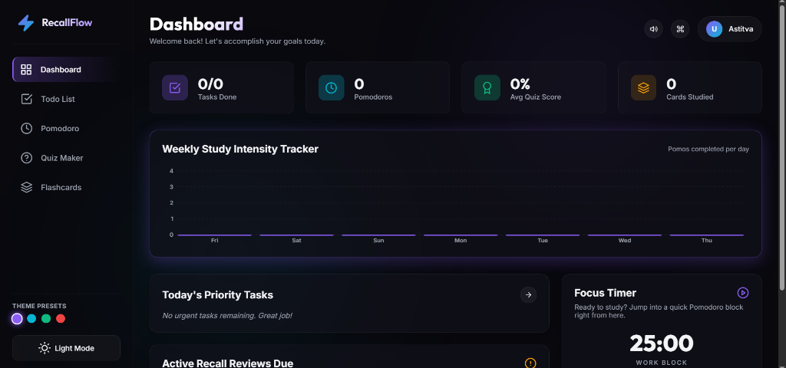
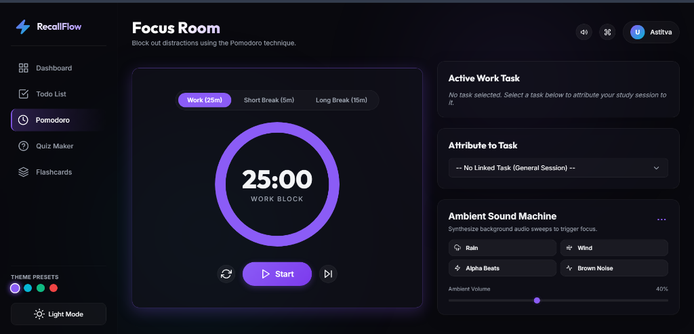
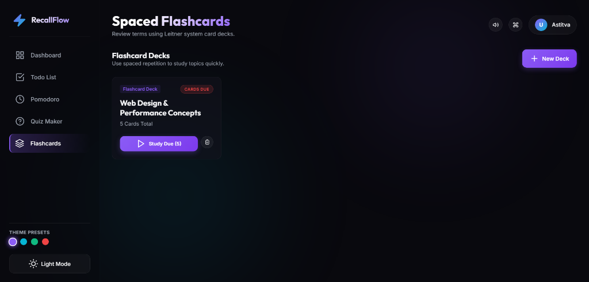
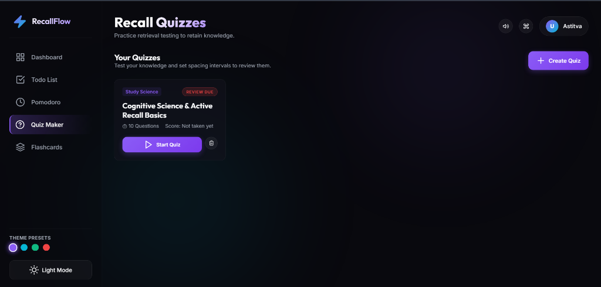
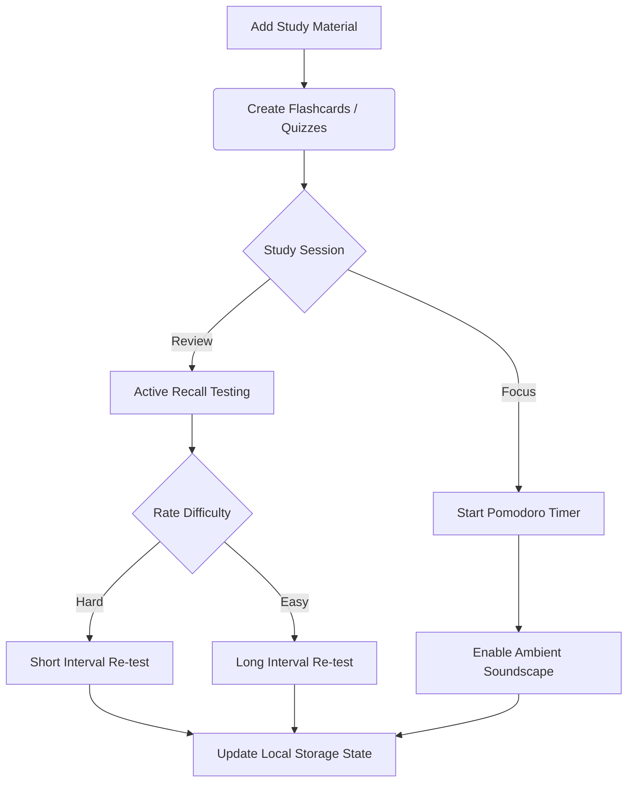
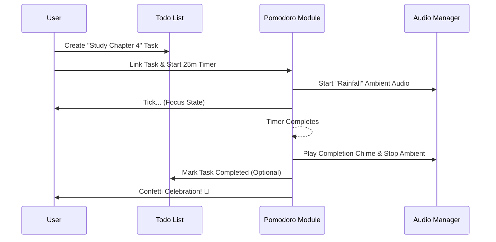

# ⚡ RecallFlow

**RecallFlow** is a premium, beautifully-designed spaced-repetition study hub that combines neuroscience-backed learning methods (Active Recall, Spaced Repetition) with productivity workflows (Pomodoro, Ambient Soundscapes).


## 🌟 Key Features

* **Active Recall Flashcards:** Practice information retrieval with 3D-flipping cards and rate your memory retention.
* **Smart Quiz Maker:** Build custom tests with dynamic scoring and spaced review scheduling.
* **Pomodoro Focus Timer:** Link study sessions to priority tasks and track your work/break cycles visually.
* **Ambient Sound Machine:** Generate client-side binaural beats, brown noise, wind, and rain sounds to achieve flow state—without external dependencies.
* **Dynamic Premium Themes:** Switch between Aurora Glow, Ocean Breeze, Forest Deep, and Sunset Glow styles.
* **Comprehensive Dashboard:** Track daily tasks, weekly study intensity, pomodoro sessions, and pending active recall reviews.
---

## 📸 Screenshots

<div align="center">
  
  
</div>
<div align="center">
  
  
</div>

---
## 🧠 Workflows & Architecture

### The Study Lifecycle
RecallFlow encourages a cycle of learning, testing, and focusing.



### The Pomodoro Focus Engine
Our timer doesn't just tick down; it integrates with your task list and audio environment.



---

## 🚀 Getting Started

Since RecallFlow is a client-side Single Page Application (SPA), getting it running is extremely simple.

### Prerequisites
* [Node.js](https://nodejs.org/) installed on your machine.

### Installation

1. **Clone the repository**
   ```bash
   git clone https://github.com/yourusername/RecallFlow.git
   cd RecallFlow
   ```

2. **Run the local development server**
   ```bash
   npm start
   ```
   *(This uses `npx http-server` under the hood).*

3. **Open your browser**
   Navigate to `http://localhost:8000` to begin your study session!

---

## 💾 State Persistence
RecallFlow automatically saves all your flashcards, quizzes, and study statistics directly to your browser's `localStorage` (`recallflow_state`). No databases or account sign-ups are required to start being productive.

